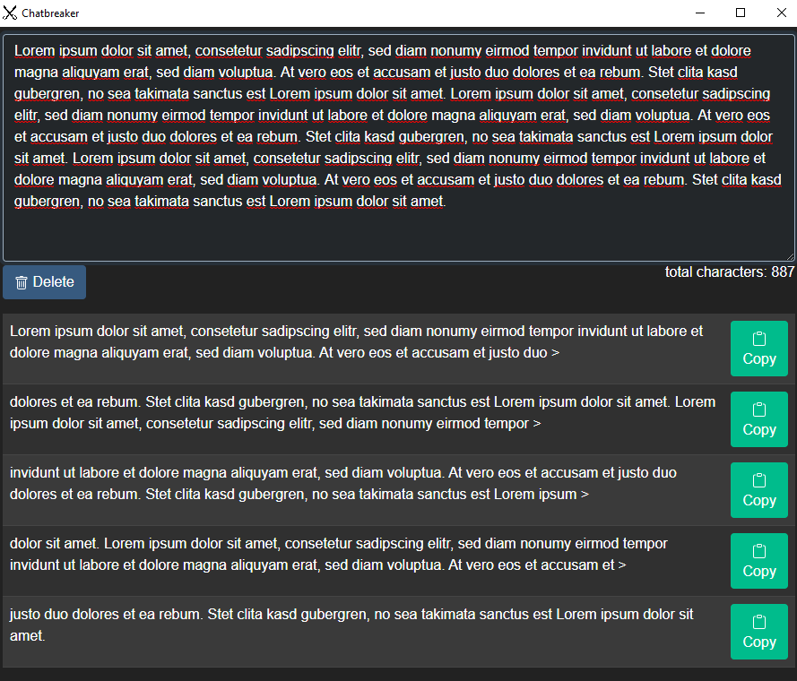

# Gw2-Chatbreaker
Chatbreaker is an application for separating text into single chat messages. Specified for Guild Wars 2 chat messages.

## What is the chatbreaker?
### Is he breaking the chat? Oo
The chatbreaker does not destroy the chat in any way. It is an independent program that runs under Windows. It is intended for those who like long texts. GW2 currently allows chat messages with a maximum of 199 characters to be sent. This can influence the writing flow, to see whether the word still fits into the message, where it is best to mark the fact that more text follows or maybe you accidentally delete the typed message with the arrow keys every now and then and delete a previous one message to load. Or you have prescribed certain scenarios and descriptions for an RP event evening that are just waiting to be properly divided into messages.

## How does the program work?
Any length of text can be entered with the Chatbreaker. As long as your computing power and memory allows it ;). From this text he generates a table. Each line contains a message with a maximum of 199 characters. It is checked whether a word still fits in the message. If it no longer fits, it is immediately transferred to the new message or the new message is opened with it. A follow-up character that signals there is more text to follow and it is not yet finished is automatically inserted into the message (most will know it as ">"). Unless you are really ready with the text. Each line contains an associated "Copy to clipboard" button with which the message can be copied and finally pasted into GW2 with Stgr + v. Here I made a conscious decision to use manual copy + paste. On the one hand, there must be a small pause between messages (most of them not noticeable), on the other hand, it should prevent the chat from being misused by automatic gold-selling messages or other forms of spam.
The program is a stand-alone executable program. It runs independently and is neither an add-on nor an overlay. 

## I am missing a feature!
Then write to me :). Via the forum here, via Discord, ingame or via Github. Simply take the contact option from the profile. Maybe you would like to help develop the program.
I will accumulate the feature requests until another release is worth it. 

## How it looks like
<br>

<br>

## Project setup (dev only)
```
npm install
```

### Compiles and hot-reloads for development
```
npm run electron:serve
```

### Compiles and minifies for production
#### Windows
```
npm run electron:win 
```

#### Linux
```
npm run electron:linux
```
